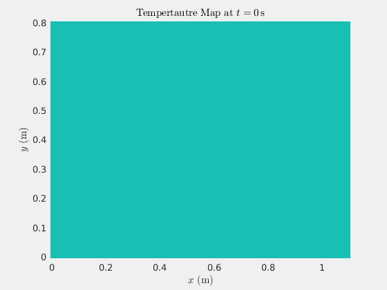

# Thermo Solver
Thermal conduction simulator using a Finite Volumes solver for *Gas Dynamics and Heat and Mass Trasnsfer*



## Instructions
First of all, make sure [`g++-6`](https://launchpad.net/~ubuntu-toolchain-r/+archive/ubuntu/test) is installed and available in the `$PATH`. Then:
```bash
make # compile all them files
./thermo # run the simulator!
```

## Features
### Phase 1 (*currently under development*)
- 2D transient conduction analysis with multiple materials

#### Improvements
- Divide in as many regions as CPUs (use `std::thread::hardware_concurrency()`)
- Solve each region with a line-by-line solver with supposed `Tboundaries`
- Each region communicates the new `Tboundaries` to the surrounding ones (and back)
- Polymorphism for the `Condition` class: make derived `Convection`, `Isotherm`, `Flow` `Adiabatic` classes

### Phase 2
- Navier-Stokes discretization: mass + momentum + (energy)

### Phase 3
- Convection with 2D laminar flow

### Phase 4
- Convection with 3D turbulent flow
